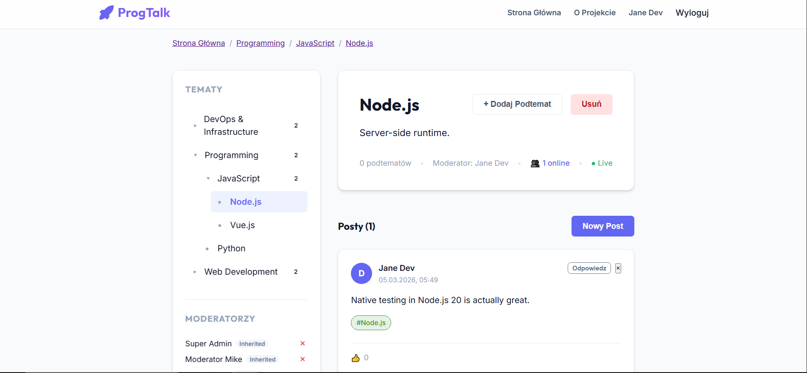

# ProgTalk

Full-stack web app for developer discussions, built as a university project and polished for a junior portfolio.

## What It Does
- Topic-based discussions with nested topic tree
- Role-based permissions (user, moderator, admin)
- JWT authentication with refresh tokens
- Real-time updates with Socket.io
- HTTPS-ready local setup with self-signed certs

## Screenshot


## Tech Stack
- Backend: Node.js, Express, MongoDB, Mongoose, Socket.io
- Frontend: Vue 3, Vue Router, Axios, Vite
- DevOps: Docker, Docker Compose, HTTPS certificates

## Quick Start (Docker)
1. Create env file:
```bash
cp .env.example .env
```
2. Generate local certificates:
```powershell
cd certs
.\generate-certs.ps1
```
3. Run app:
```bash
docker compose up --build
```
4. Open:
- App: `https://localhost:3000`
- API health: `https://localhost:3000/api/health`

Note: first run may show a browser warning because certificates are self-signed.

## Demo Accounts
- Admin: `admin@progtalk.com` / `admin123`
- User: `john@example.com` / `user123`

## Project Structure
```text
backend/   Express API + Socket.io + Mongo models/routes/services
frontend/  Vue application source
certs/     Local SSL certificate scripts
```

## Why This Project
This project demonstrates practical full-stack skills: authentication, real-time communication, role-based access, secure local setup, and Docker-based deployment workflow.
