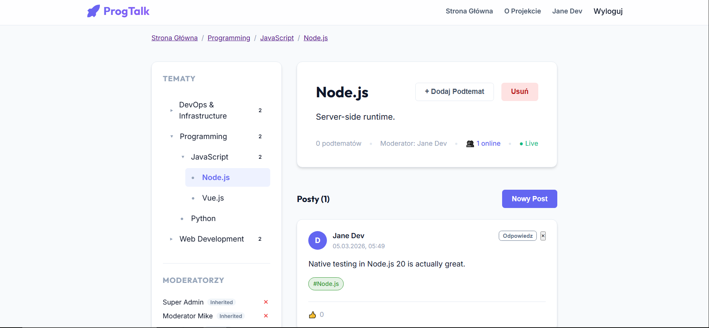

# ProgTalk

Full-stack web app for developer discussions, built as a university project and polished for a junior portfolio.

## What It Does
- Topic-based discussions with nested topic tree
- Role-based permissions (user, moderator, admin)
- JWT authentication with refresh tokens
- Real-time updates with Socket.io
- HTTPS-ready local setup with self-signed certs

## Screenshot


## Tech Stack
- Backend: Node.js, Express, MongoDB, Mongoose, Socket.io
- Frontend: Vue 3, Vue Router, Axios, Vite
- DevOps: Docker, Docker Compose, HTTPS certificates

## Quick Start (Docker)
1. Create env file:
```bash
cp .env.example .env
```
2. Generate local certificates:
```powershell
cd certs
.\generate-certs.ps1
```
3. Run app:
```bash
docker compose up --build
```
4. Open:
- App: `https://localhost:3000`
- API health: `https://localhost:3000/api/health`

Note: first run may show a browser warning because certificates are self-signed.

## External Deployment (VPS, Not Your PC)
Use this when you want the app online 24/7 on an external server.

### 1. Prepare Production Environment File
Create a production env file from template:

```bash
cp .env.prod.example .env.prod
```

Fill real values in `.env.prod`:
- `FRONTEND_URL` and `CORS_ALLOWED_ORIGINS` set to your public domain
- Strong JWT secrets
- Production MongoDB credentials/URI

### 2. Upload Project to Server
On your VPS (Ubuntu example), clone or pull this repository:

```bash
git clone <your-repository-url>
cd tsw_projekt
```

Then copy your `.env.prod` onto the server (do not commit it).

### 3. Run Production Stack
Start backend + mongo + reverse proxy:

```bash
docker compose --env-file .env.prod -f docker-compose.prod.yml up -d --build
```

This stack includes:
- `backend` (Node.js API + built Vue frontend)
- `mongo` (database)
- `nginx` (public entrypoint on port 80)

### 4. Verify Deployment
- Open `http://<your-server-ip-or-domain>`
- Check API health at `http://<your-server-ip-or-domain>/api/health`
- Check logs if needed:

```bash
docker compose --env-file .env.prod -f docker-compose.prod.yml logs -f
```

### 5. HTTPS (Recommended)
Use Let's Encrypt with the included TLS stack.

1. Keep HTTP stack running (`docker-compose.prod.yml`) so ACME challenge is reachable on port 80.
2. Issue certificate (replace values with your own):

```bash
docker compose --env-file .env.prod -f docker-compose.prod.tls.yml run --rm --profile certbot certbot certonly \
	--webroot -w /var/www/certbot \
	-d your-domain.example \
	--email you@example.com --agree-tos --no-eff-email
```

3. Switch to TLS stack:

```bash
docker compose --env-file .env.prod -f docker-compose.prod.yml down
docker compose --env-file .env.prod -f docker-compose.prod.tls.yml up -d --build
```

4. Verify:
- `https://your-domain.example`
- `https://your-domain.example/api/health`

5. Renew certificate (recommended via cron, every day):

```bash
docker compose --env-file .env.prod -f docker-compose.prod.tls.yml run --rm --profile certbot certbot renew
docker compose --env-file .env.prod -f docker-compose.prod.tls.yml exec nginx nginx -s reload
```

### Notes
- Your PC is not the server. It is only used to push code updates.
- Server updates are done by pulling new commits and rerunning the production compose command.
- Open firewall ports `80` and `443` on the VPS.

## Demo Accounts
- Admin: `admin@progtalk.com` / `admin123`
- User: `john@example.com` / `user123`

## Project Structure
```text
backend/   Express API + Socket.io + Mongo models/routes/services
frontend/  Vue application source
certs/     Local SSL certificate scripts
```

## Why This Project
This project demonstrates practical full-stack skills: authentication, real-time communication, role-based access, secure local setup, and Docker-based deployment workflow.
